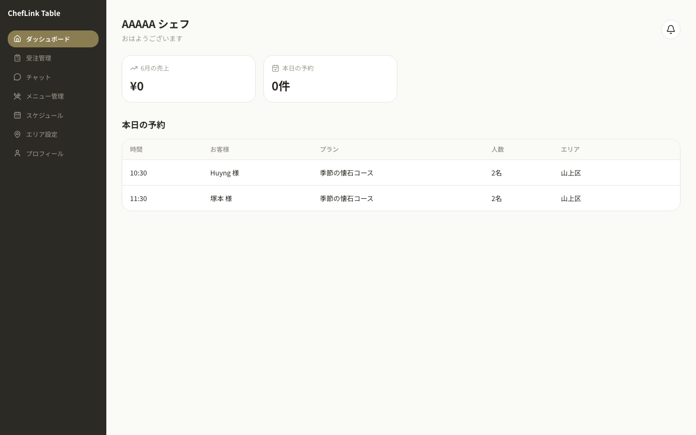
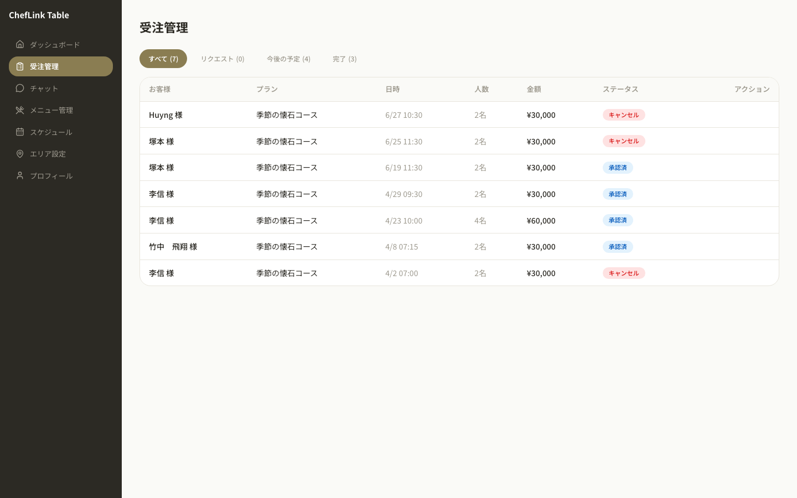
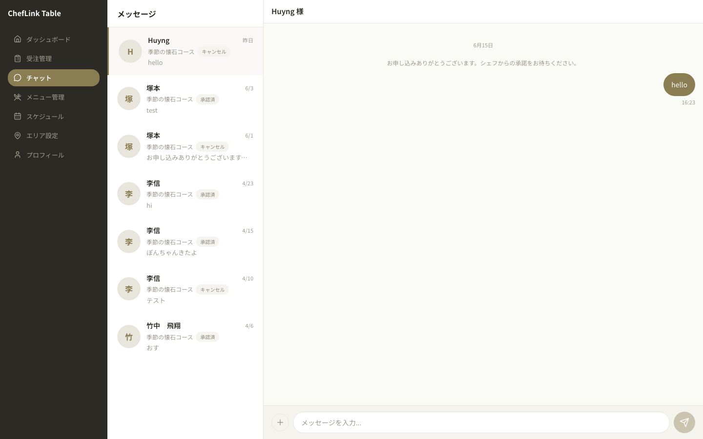
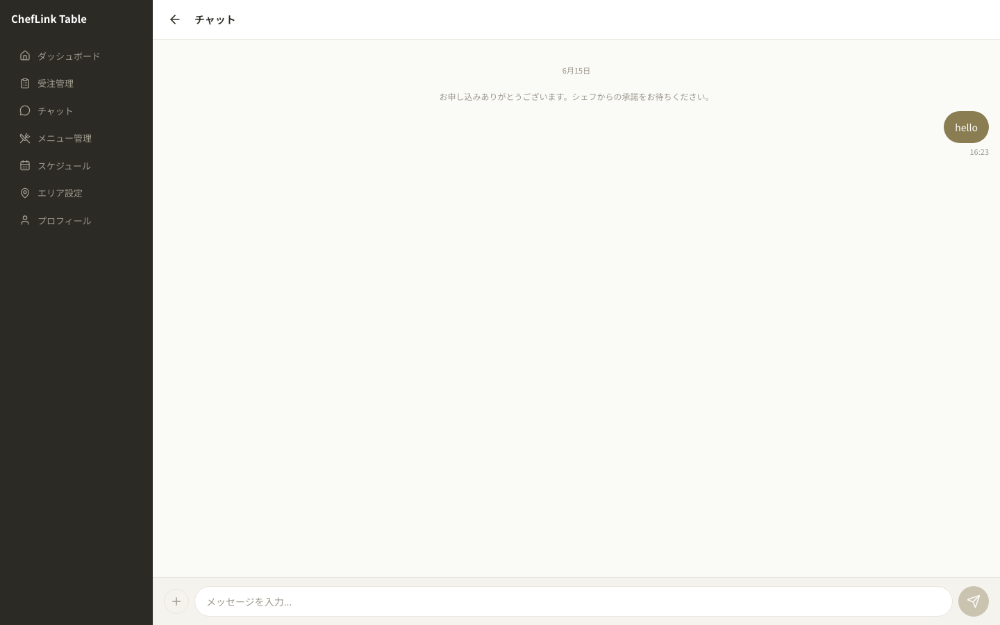
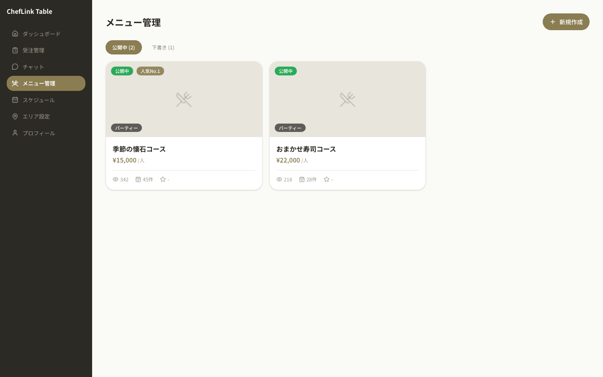
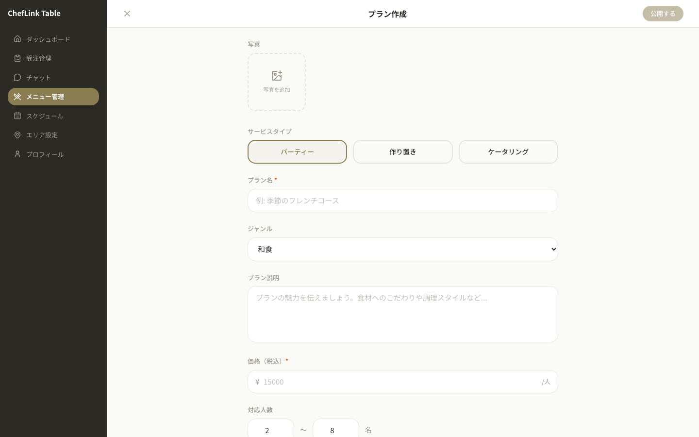
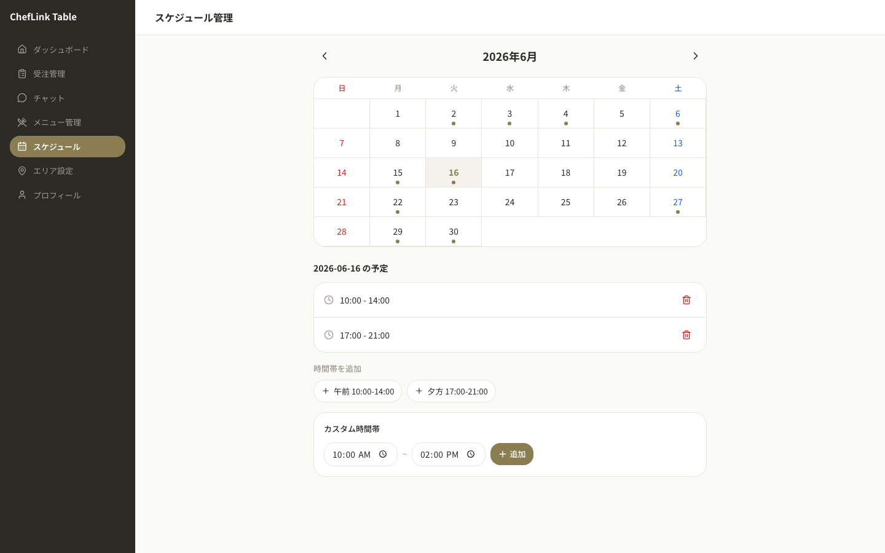
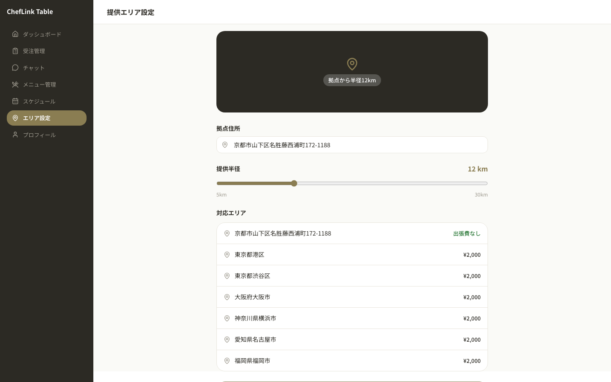
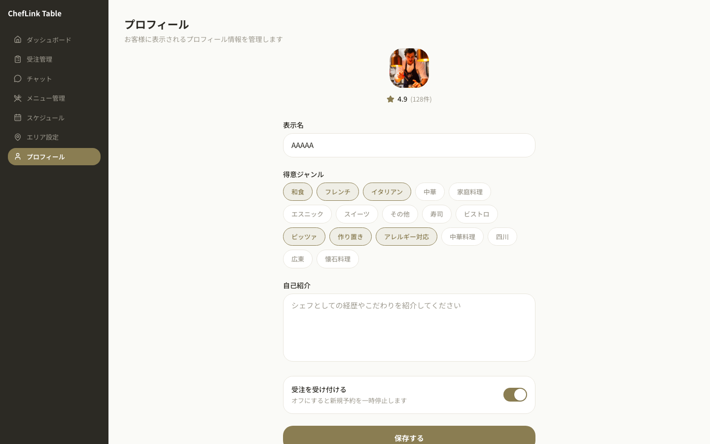

# Scan Chef Sharedine

Chef-facing prototype built with React, TypeScript, Vite, Tailwind CSS v4, and `react-router-dom`.

## Run

```bash
npm install
npm run dev
```

Default routes are defined in `src/App.tsx` and rendered inside the shared `ChefLayout`.

## App Structure

### Shared Layout Components

- `ChefLayout`: app shell, mobile header, mobile drawer, desktop layout, route outlet
- `ChefSidebar`: desktop navigation sidebar
- `PageHeader`: reusable page title, subtitle, and optional action area
- `PageContent`: shared horizontal page padding wrapper

### Pages And Main Components

| Route | Page | Main components |
| --- | --- | --- |
| `/` | `DashboardPage` | `DashboardHeader`, `DashboardStats`, `DashboardReservationsSection` |
| `/bookings` | `BookingsPage` | `PageHeader`, `PageContent`, `Table`, `Badge` |
| `/chats` | `ChatsPage` | `ChatThreadList`, `ChatConversationPane` |
| `/chat/:threadId` | `ChatDetailPage` | `ChatConversationPane` |
| `/plans` | `PlansPage` | `PageHeader`, `PageContent`, `Button`, internal `TabFilter`, internal `PlanCard` |
| `/plans/new` | `PlanCreatePage` | `PlanCreateHeader`, `PlanPhotoUpload`, `PlanServiceTypeSelector`, `PlanMenuItemsField` |
| `/schedule` | `SchedulePage` | `ScheduleCalendar`, `ScheduleDayDetail`, `PageContent` |
| `/service-area` | `ServiceAreaPage` | `ServiceAreaMapHero`, `ServiceAreaAddressInput`, `ServiceAreaRadiusSlider`, `ServiceAreaList`, `ServiceAreaBottomBar` |
| `/profile` | `ProfilePage` | `PageHeader`, `PageContent`, `Button` |

## Desktop Screenshots

### Dashboard

Route: `/`

Components: `DashboardHeader`, `DashboardStats`, `DashboardReservationsSection`



### Bookings

Route: `/bookings`

Components: `PageHeader`, `PageContent`, `Table`, `Badge`



### Chats

Route: `/chats`

Components: `ChatThreadList`, `ChatConversationPane`



### Chat Detail

Route: `/chat/:threadId`

Components: `ChatConversationPane`



### Plans

Route: `/plans`

Components: `PageHeader`, `PageContent`, internal `TabFilter`, internal `PlanCard`, `Button`



### Plan Create

Route: `/plans/new`

Components: `PlanCreateHeader`, `PlanPhotoUpload`, `PlanServiceTypeSelector`, `PlanMenuItemsField`



### Schedule

Route: `/schedule`

Components: `ScheduleCalendar`, `ScheduleDayDetail`, `PageContent`



### Service Area

Route: `/service-area`

Components: `ServiceAreaMapHero`, `ServiceAreaAddressInput`, `ServiceAreaRadiusSlider`, `ServiceAreaList`, `ServiceAreaBottomBar`



### Profile

Route: `/profile`

Components: `PageHeader`, `PageContent`, `Button`



## Notes

- Screenshot assets live in `screenshots/`.
- Chat detail screenshot was captured using `/chat/huyng-yesterday`.
- The repo currently looks like a UI prototype with local mock data stored directly in page/component files.
